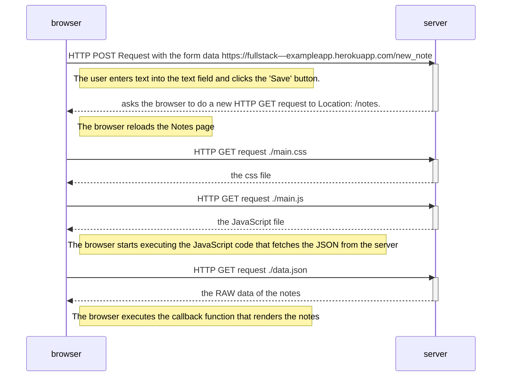

```mermaid
sequenceDiagram
    participant browser
    participant server

    browser->>server: HTTP POST Request with the form data https://fullstack—exampleapp.herokuapp.com/new_note
    activate server
    Note right of browser: The user enters text into the text field and clicks the 'Save' button.
    server-->>browser: asks the browser to do a new HTTP GET request to Location: /notes.
    deactivate server

    Note right of browser: The browser reloads the Notes page

    browser->>server: HTTP GET request ./main.css
    activate server
    server-->>browser: the css file
    deactivate server

    browser->>server: HTTP GET request ./main.js
    activate server
    server-->>browser: the JavaScript file
    deactivate server

    Note right of browser: The browser starts executing the JavaScript code that fetches the JSON from the server

    browser->>server: HTTP GET request ./data.json
    activate server
    server-->>browser: the RAW data of the notes
    deactivate server

    Note right of browser: The browser executes the callback function that renders the notes

```
