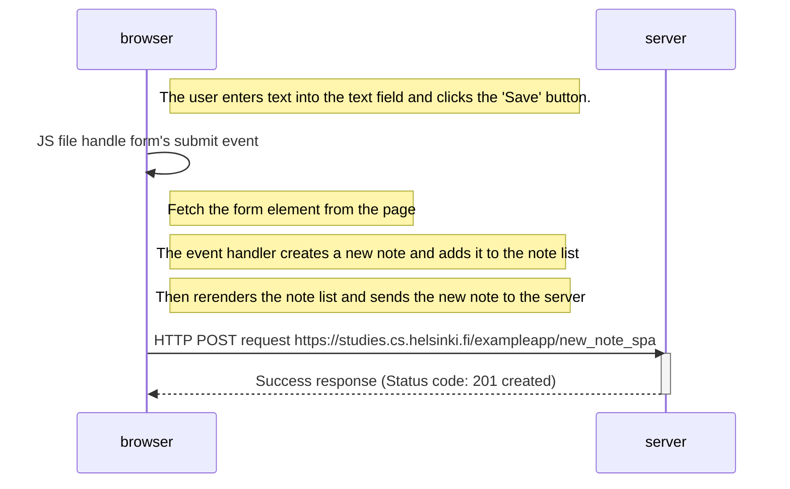

```mermaid
sequenceDiagram
    participant browser
    participant server

Note right of browser: The user enters text into the text field and clicks the 'Save' button.

    browser->>browser: JS file handle form's submit event
     Note right of browser: Fetch the form element from the page
     Note right of browser: The event handler creates a new note and adds it to the note list
     Note right of browser: Then rerenders the note list and sends the new note to the server

    browser->>server: HTTP POST request https://studies.cs.helsinki.fi/exampleapp/new_note_spa
    activate server
    server-->>browser: Success response (Status code: 201 created)
    deactivate server
```
